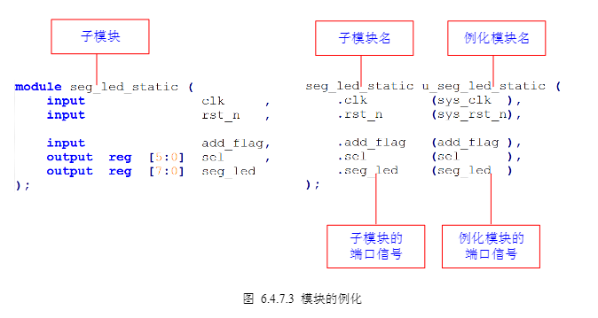
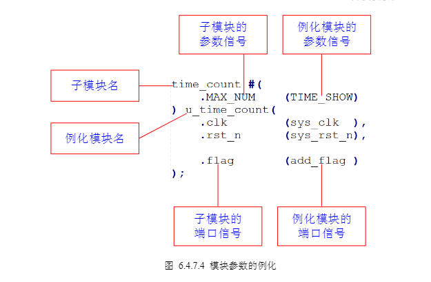

# verilog语法二---进阶篇

## 过程赋值
过程赋值用于在`initial`和`always`语句块中进行赋值，有阻塞赋值和非阻塞赋值两种。<br>
***过程赋值与连续赋值的区别***：
* 连续性赋值总是处于激活状态，任何操作数的改变都会影响表达式的结果
* 过程赋值只有在语句执行的时候，才会起作用

### 阻塞赋值`=`
* 阻塞指在一个always块中，后面的语句会受到前语句的影响，在同一个always中，一条阻塞赋值语句如果没有执行结束，那么该语句后面的语句就不能被执行，即被“阻塞”。简言之，***语句块内顺序执行***。

例如：
```verilog
always @(posedge clk or negedge rst_n)begin//clk上升沿触发或rst_n下降沿触发
    if(!rst_n)begin//rst_n低有效
        a=1;
        b=2;
        c=3;
    end
    else begin//rst_n高有效
        a=0;
        b=a;
        c=b; 
    end
end
```

### 非阻塞赋值`<=`
* 并行执行语句
```verilog
`timescale 1ns/1ns
 
module test ;
    reg [3:0]   ai, bi ;
    reg [3:0]   ai2, bi2 ;
    reg [3:0]   value_blk ;
    reg [3:0]   value_non ;
    reg [3:0]   value_non2 ;
 
    initial begin
        ai            = 4'd1 ;   //(1)
        bi            = 4'd2 ;   //(2)
        ai2           = 4'd7 ;   //(3)
        bi2           = 4'd8 ;   //(4)
        #20 ;                    //(5)
 
        //non-block-assigment with block-assignment
        ai            = 4'd3 ;     //(6)
        bi            = 4'd4 ;     //(7)
        value_blk     = ai + bi ;  //(8)
        value_non     <= ai + bi ; //(9)
 
        //non-block-assigment itself
        ai2           <= 4'd5 ;           //(10)
        bi2           <= 4'd6 ;           //(11)
        value_non2    <= ai2 + bi2 ;      //(12)
    end
 
   //stop the simulation
    always begin
        #10 ;
        if ($time >= 1000) $finish ;
    end
 
endmodule
```
注意点：
* 语句（1）-（8）都是阻塞赋值，按照顺序执行。
* 语句（9）-（12）都是非阻塞赋值，并行执行。但是执行顺序也是在（8）之后.

### assign和always的区别
* `assign`不可以带时钟，`always`可以带时钟，当always不带时钟时与assign逻辑功能完全一致。`assign`，`always`和`always@(*)`用于组合逻辑。
* `assign`之后不能加块，实现组合逻辑只能逐句使用`assign`
* 被`assign`赋值的信号为`wire`型，在`always`块下被赋值的信号为`reg`类型，但此处并非真正的触发器只有带上敏感列表才会被综合成触发器。

### latch（锁存器）和FF（触发器）
* 锁存器（Latch），是电平触发的存储单元，数据存储的动作取决于输入时钟（或者使能）信号的电平值。仅当锁存器处于使能状态时，输出才会随着数据输入发生变化。
* 触发器（flip-flop），是边沿敏感的存储单元，数据存储的动作（状态转换）由某一信号的上升沿或者下降沿进行同步的。

引入一个概念latch会产生危害尽量在电路中不要引入latch，原因主要有：
1. 输入状态可能多次变化，容易产生毛刺，增加了下一级电路的不确定性；
2. 在大部分 FPGA 的资源中，可能需要比触发器更多的资源去实现 Latch 结构；
3. 锁存器的出现使得静态时序分析变得更加复杂。

出现latch情况：
* 不带时钟的always语句if、case语句不完整才会产生latch，不过注意带时钟的语句if或者case语句不完整描述不会产生latch。

## 状态机（FSM有限状态机）
根据输出是否与输入有关可以分为：
1. moore(摩尔)型状态机，输出与当前无关，可以通过摩尔庄园没人玩了来联想记忆。
2. mealy(米粒)型状态机，输出与当前有关。
根据状态机的实际写法，可以分为：
1. 一段式
2. 二段式
3. 三段式（推荐方式）：
   1. 第一段，时序逻辑，非阻塞赋值，传递寄存器的状态；<br>第一个always语句实现同步状态跳转
   2. 第二段，组合逻辑，阻塞赋值，根据当前状态和当前输入，确定下一个状态机的状态；<br>第二个always语句采用组合逻辑判断状态转移条件； 
   3. 第三段，时序逻辑，非阻塞赋值，因为是 Mealy 型状态机，根据当前状态和当前输入，确定输出信号；<br>第三个always语句描述状态输出(可以用组合电路输出，也可以时序电路输出)。

使用示例：<br>
第一步：画出状态转移图
```verilog
parameter S0 = 7'b0000001;  
parameter S1 = 7'b0000010; 
parameter S2 = 7'b0000100; 
parameter S3 = 7'b0001000; 
parameter S4 = 7'b0010000; 
parameter S5 = 7'b0100000; 
parameter S6 = 7'b1000000;   
```
这里对于状态使用的是One-hot码，在数电的学习中一般使用的一般就是正常二进制数。由于采用7位One-hot码所以采用两个7位的寄存器来存储当前状态和下个状态。
```verilog
reg  [6:0]   curr_st     ;     
reg  [6:0]   next_st     ;     
```
第二步：开始编写三段式状态机代码<br>
代码中首先是模块声明
```verilog
module divider7_fsm (  
    input       sys_clk      , //系统时钟 
    input       sys_rst_n    , //系统复位
    output reg  clk_divide_7  //输出时钟
    );
```
然后是之前第一步确定的状态
```verilog
parameter S0 = 7'b0000001;  
parameter S1 = 7'b0000010; 
parameter S2 = 7'b0000100; 
parameter S3 = 7'b0001000; 
parameter S4 = 7'b0010000; 
parameter S5 = 7'b0100000; 
parameter S6 = 7'b1000000;   
```
开始状态机的第一段代码，状态机的第一段***采用同步时序描述状态转移***。
```verilog
always @(posedge sys_clk or negedge sys_rst_n) begin  
        if (!sys_rst_n) 
            curr_st <= S0; 
        else 
            curr_st <= next_st; 
end 
```
`sys_clk`上升沿并且`sys_rst_n`无效时，变到下一个状态。
然后是状态机的第二段代码，状态机的第二段***采用组合逻辑判断状态转移条件*** 

```verilog
always @(*) begin  
    case (curr_st)  
        S0: next_st = S1; 
        S1: next_st = S2; 
        S2: next_st = S3; 
        S3: next_st = S4; 
        S4: next_st = S5; 
        S5: next_st = S6; 
        S6: next_st = S0; 
        default: next_st = S0; 
    endcase 
end 
```
再然后是状态机的第三段代码，状态机的第三段描述状态输出(这里采用时序电路输出)
```verilog
always @(posedge sys_clk or negedge sys_rst_n) begin  
    if (!sys_rst_n) 
        clk_divide_7 <= 1'b0; 
    else if ((curr_st == S0) | (curr_st == S1) | (curr_st == S2)  | (curr_st == S3))  
        clk_divide_7  <= 1'b0; 
    else if ((curr_st == S4) | (curr_st == S5) | (curr_st == S6))  
        clk_divide_7  <= 1'b1;    
    else 
        ;  
end
```
意义上代码描述的输出：
* 当`sys_rst_n`有效时，输出时钟信号为低电平
* 当`sys_rst_n`无效时，前四个状态输出低，后三个状态输出低

很容易发现此时输出时钟的一个周期为7个系统时钟的周期，即七分频。

## 模块化设计
提出几个概念：
1. 自顶向下的设计方式：可以把系统划分成几个功能模块，每个功能模块再划分成下一层的子模块
2. 例化：在一个模块中引用另一个模块，对其端口进行相关连接，叫做模块例化。模块例化建立了描述的层次。信号端口可以通过位置或名称关联，端口连接也必须遵循一些规则。在顶层设计一般只做例化。

请看如下例子：设计结构如下
1. 顶层
   1. 计时器模块
   2. 数码管静态显示模块


在代码上的体现：
1. 计时器模块
```verilog
module time_count( 
    input           clk     ,   // 时钟信号
    input           rst_n   ,   // 复位信号 

    output   reg    flag        // 一个时钟周期的脉冲信号 
); 

//parameter define 
parameter  MAX_NUM = 25000_000; // 计数器最大计数值

//其他代码省略

endmodule
```
2. 数码管静态显示模块
```verilog
module seg_led_static ( 
    input               clk     ,   // 时钟信号 
    input               rst_n   ,   // 复位信号（低有效） 

    input               add_flag,   // 数码管变化的通知信号 
    output  reg  [5:0]  sel     ,   // 数码管位选 
    output  reg  [7:0]  seg_led     // 数码管段选 
); 

//其他代码省略

endmodule
```
3. 顶层模块
```verilog
module seg_led_static_top ( 
    input               sys_clk  ,       // 系统时钟 
    input               sys_rst_n,       // 系统复位信号（低有效） 

    output    [5:0]     sel      ,       // 数码管位选 
    output    [7:0]     seg_led          // 数码管段选 

); 


//parameter define 
parameter  TIME_SHOW = 25'd25000_000;    // 数码管变化的时间间隔0.5s 

//wire define 
wire       add_flag;                     // 数码管变化的通知信号 

//***************************************************** 
//**                    main code 
//***************************************************** 

//例化计时模块 
time_count #( 
    .MAX_NUM    (TIME_SHOW) 
) u_time_count( 
    .clk        (sys_clk  ), 
    .rst_n      (sys_rst_n), 
    
    .flag       (add_flag ) 
); 

//例化数码管静态显示模块 
seg_led_static u_seg_led_static ( 
    .clk        (sys_clk  ),  
    .rst_n      (sys_rst_n), 

    .add_flag   (add_flag ),  
    .sel        (sel      ), 
    .seg_led    (seg_led  ) 
); 

endmodule
```
子模块例化方法
<br>
子模块参数例化方法<br>



OK！这就是这次的进阶篇了，下篇要介绍的是Verilog编程规范。


